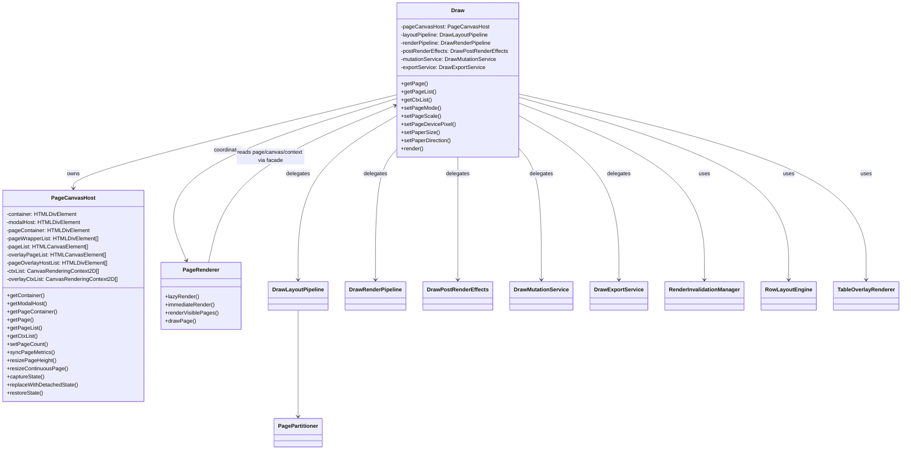
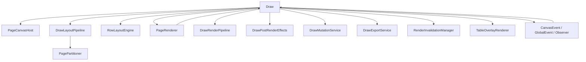
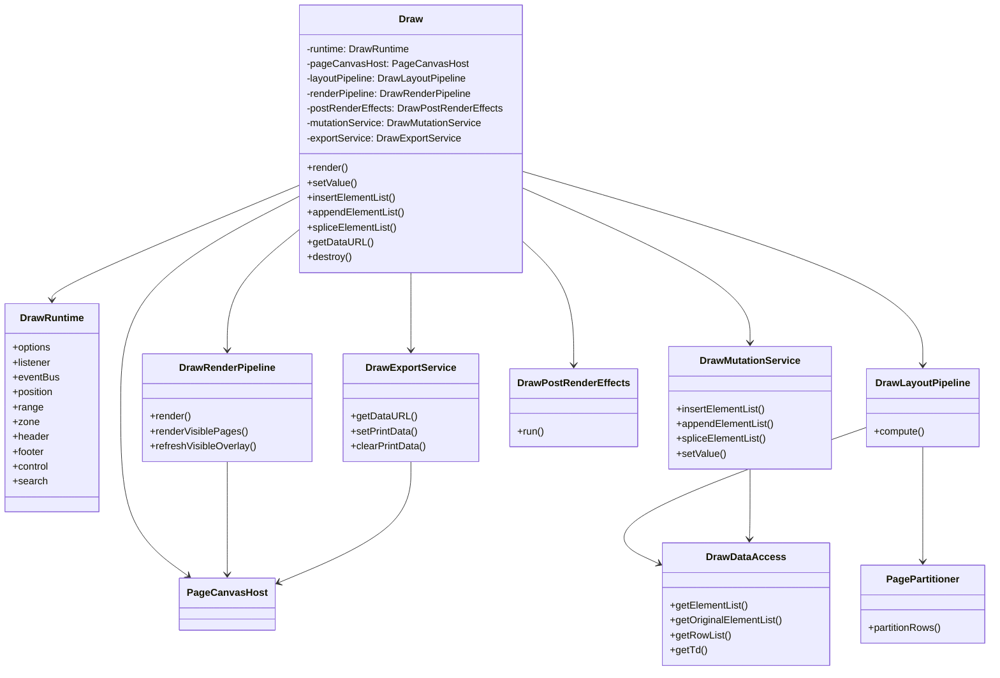
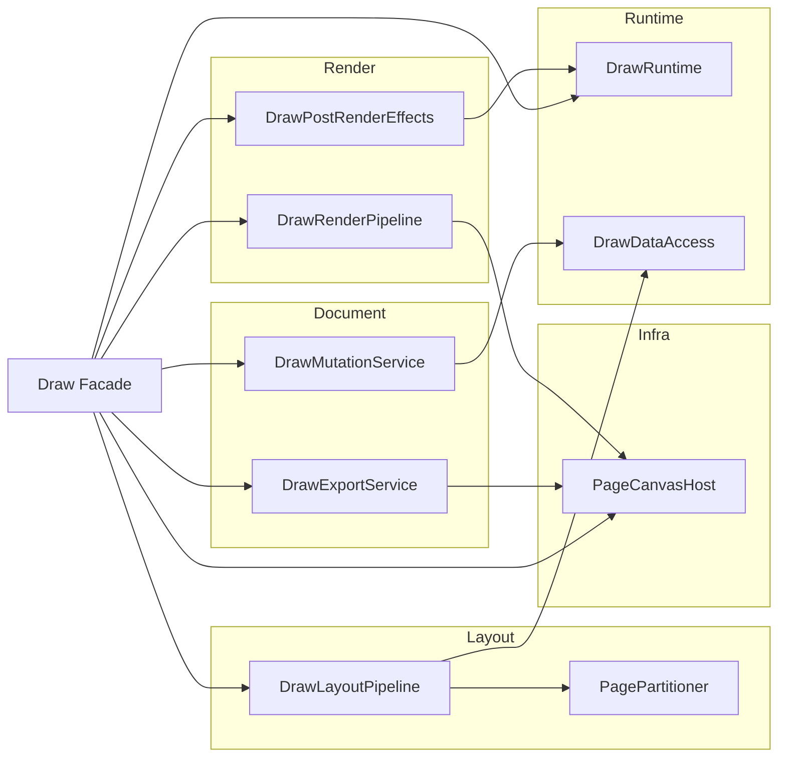
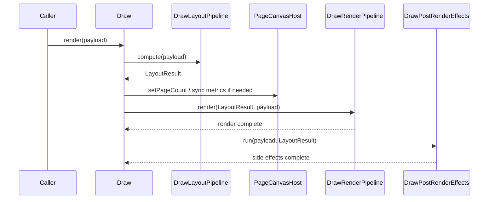

# `Draw` 重构类图与依赖图

## 目的

这份文档用于补充 [`draw-refactor-plan.md`](./draw-refactor-plan.md)，把模块关系画清楚，方便后续继续按阶段推进。

本文分两部分：

1. 第一阶段落地后的实际结构
2. 目标重构完成后的推荐结构

---

## 第一阶段现状图

当前已经完成的核心模块有：

- `PageCanvasHost`
- `DrawLayoutPipeline`
- `PagePartitioner`
- `DrawRenderPipeline`
- `DrawPostRenderEffects`
- `DrawMutationService`
- `DrawExportService`
- `DrawViewState`
- `DrawDataAccess`
- `DrawHistoryBridge`
- `PageSetupService`
- `DrawValueService`
- `DrawCursorService`
- `DrawRuntime`
- `DrawViewportService`
- `DrawExportStateService`
- `DrawComponentRegistry`
- `DrawServiceRegistry`
- `DrawStateQueryService`
- `DrawMetricsService`
- `DrawRenderFacadeService`
- `DrawPainterService`
- `DrawLifecycleService`

其中 `PageCanvasHost` 负责接管：

- 根容器包装
- `modalHost`
- `pageContainer`
- page / overlay / wrapper / ctx 生命周期
- page count 增减
- dpr / scale / size 同步
- 连续页高度调整
- 导出时的 detached render surface 切换

`Draw` 仍然是总协调器，但已经不再自己维护 page/canvas/overlay 底层资源，也不再直接承载 layout / mutation / export 的主流程。

当前 `Draw.ts` 大约 `718` 行。

## 当前实现形态

当前 `Draw` 的内部结构更接近：

- `runtime`: 运行时状态
- `components`: 重型对象注册表
- `services`: 流程与桥接服务注册表

也就是说，`Draw` 本身已经不再是主要实现体，而更像对外 facade。

## 当前收口方向

在 facade getter 已经分批退役之后，当前的重构重点不再只是“继续删 getter”，而是：

1. 让内部 service 直接依赖 `runtime/components/services`
2. 避免 service 再通过 `Draw` 做二次转发
3. 进一步削弱 `Draw` 作为内部总线的角色

已经开始按这个方向收口的内部流程模块：

- `DrawRenderPipeline`
- `DrawRenderFacadeService`
- `DrawLayoutPipeline`
- `DrawPostRenderEffects`
- `DrawViewportService`
- `DrawExportStateService`
- `DrawHistoryBridge`
- `DrawStateQueryService`
- `DrawMetricsService`
- `DrawDataAccess`
- `DrawExportService`
- `PageSetupService`
- `DrawMutationService`
- `DrawValueService`
- `DrawCursorService`

## 收官视角

从当前调用分布看，`Draw` 已经不再需要继续做大规模机械拆分。  
后续更合理的收尾方向是：

1. 保留核心 facade：
   `mode/options/page/value/element/range/position`
2. 继续削减内部过渡入口：
   `render/layout/snapshot/control/search/particle`
3. 对低频 getter 做小批次退役，而不是一次性清空表面积

当前阶段，`Draw` 更像：

- 对外主门面
- 对内过渡接线层
- 构造期 bootstrap 稳定器

也就是说，剩余表面积已经不是简单的“越少越好”，而是要按职责分级处理。

## 构造期 bootstrap 说明

当前实现里有一条非常重要的初始化规则：

很多对象在构造时就会立即通过 `draw.getXxx()` 反查其它对象。  
因此 facade getter 必须在构造期就可用，不能只依赖“最终的 registry 已赋值”。

当前已经通过两种方式解决：

1. 纯计算项允许从 `runtime/viewState` 读取默认状态
2. 核心重型对象通过 bootstrap 引用兜底，再由 getter 回退访问

这意味着：

- `Draw` 的 facade getter 现在不只是对外门面，也是构造期依赖稳定器
- 后续如果继续删除 getter，必须先消除这些构造期反查关系

进一步的落地约束：

- 处于 `DrawComponentRegistry` 构造链中的对象，不应直接改成依赖 `draw.getComponents()`
- 这类对象必须继续走 facade getter，以利用 bootstrap 兜底引用
- 外围依赖迁移应优先选择：
  - 构造完成后才运行的模块
  - 只缓存稳定依赖且不参与 bootstrap 链的模块

## 外围迁移现状

当前已经开始把外围模块从 `draw.getXxx()` 逐步迁移到更明确的访问入口。

第一批已落地模块：

- `GlobalEvent`
- `ContextMenu`
- `CommandAdapt` 构造期依赖
- `Cursor` 构造期依赖
- `CursorAgent`
- `Zone`
- `ZoneTip`
- `Previewer`
- `PageBorder`
- `PageNumber`
- `Background`
- `Margin`
- `Placeholder`
- `LineNumber`
- `ImageParticle`
- `HyperlinkParticle`
- `Shortcut`
- `CanvasEvent`
- `WorkerManager`
- 运行期事件处理器：`mousedown` / `mousemove` / `backspace` / `delete`
- 运行期事件处理器：`left` / `right` / `updown` / `click` / `mouseup`
- 运行期事件处理器：`drag` / `cut` / `input` / `paste`
- 运行期工具：`resolveSelectionStartState`

当前策略不是一次性删除 getter，而是：

1. 先把外围模块改成优先依赖 `components/services/runtime`
2. 再统计哪些 facade getter 已经没有外部消费者
3. 最后再删除过渡 getter

当前已经进入第 3 步，第一批已删除 facade getter：

- `getModalHost()`
- `getPageContainer()`
- `getCanvasEvent()`
- `getWorkerManager()`

第二批已删除 facade getter：

- `getGlobalEvent()`
- `getTableOperate()`

第三批已删除 facade getter：

- `getOverlayPage()`
- `getPageOverlayHost()`
- `getPageOverlayHostList()`
- `getPrintModeData()`
- `getRuntimeRowList()`

第四批已删除 facade getter：

- `getVisiblePageNoList()`
- `getIntersectionPageNo()`
- `getRenderCount()`
- `getCtx()`
- `getCtxList()`
- `getOverlayCtxList()`

第五批已删除 facade getter：

- `getTableNavigationService()`

第六批已删除 facade getter：

- `getContainer()`

## 已解决的 Bootstrap Facade

此前作为构造期稳定器保留的三个 facade：

- `getI18n()`
- `getPreviewer()`
- `getTableTool()`

已经通过构造注入与运行期迁移被彻底移除。

第七批已删除 facade getter：

- `getI18n()`
- `getPreviewer()`
- `getTableTool()`

第八批已删除 facade getter：

- `getPageRenderer()`
- `getRenderInvalidationManager()`
- `getTableLayoutSnapshotBuilder()`
- `getDataAccess()`
- `getRowLayoutEngine()`

第九批已删除 facade getter：

- `getMainHeight()`
- `getCanvasWidth()`
- `getCanvasHeight()`
- `getPageNumberBottom()`
- `getMarginIndicatorSize()`
- `getHighlightMarginHeight()`
- `getElementSize()`
- `getElementRowMargin()`

## 最终边界建议

当前 `Draw` 更适合被理解成：

1. 对外正式门面
2. 对内有限桥接层
3. 构造期 bootstrap 稳定器

因此最终边界建议是：

### 保留为正式 facade

- mode / readonly / disabled
- page / size / margins / gap
- value / editor data
- element access 的主入口
- render / frame render / export / destroy

### 保留为内部桥接层

- `getRuntime()`
- `getComponents()`
- `getServices()`
- `getPageCanvasHost()`
- `getServices().tableLayoutSnapshotAccessor`

### 后续如有需要再退役

- `getWordLikeReg()`
- `getTableRowList()` / `getOriginalRowList()` / `getRowList()`
- `getLayoutMainElementList()`
- `getPainterStyle()` / `getPainterOptions()` / `setPainterStyle()` / `setDefaultRange()`
- 纯组件代理型 getter

这意味着当前阶段不应再为了“删得更多”而继续破坏边界稳定性。

## 类图

## 依赖图

## 第一阶段后的真实边界

### `Draw` 仍负责

- 编辑器运行时主状态
- 布局与分页编排
- 渲染策略分发
- 历史、选区、回调、副作用
- 对外 API 门面

### `PageCanvasHost` 已负责

- page canvas 底层资源
- wrapper / overlay host / overlay canvas 资源
- page DOM 创建与销毁
- canvas context 初始化
- page metrics 同步

### 当前还没有解决的问题

- `render()` 仍然过厚
- `Draw` 仍是巨型 facade
- 数据写操作还没有从 `Draw` 中拆走
- `PageRenderer` 仍通过 `Draw` 间接读取很多依赖

---

## 下一阶段目标图

第二阶段开始，建议把 `Draw` 继续瘦身为门面 + 调度器。

## 目标类图

## 目标依赖图

---

## 模块协作顺序图

下面这张图更适合指导 `render()` 的第二阶段重构。

---

## 现阶段最关键的设计约束

继续推进时，建议守住下面 4 条规则：

1. `PageCanvasHost` 之外的模块不要再直接维护 page/canvas/ctx 数组。
2. `rowList -> pageRowList` 的算法不要再直接改 DOM。
3. 文档写操作不要再直接散落在 `Draw` 的多个 API 中。
4. `render()` 只保留“调度”职责，不再继续吞布局和副作用。

---

## 下一步推荐

如果继续按这个方向推进，最合理的顺序是：

1. 新增 `DrawLayoutPipeline`
2. 把 `render()` 中 compute 阶段整体迁出
3. 新增 `PagePartitioner`
4. 把 `_computePageList()` 从 `Draw` 中迁出
5. 再拆 `DrawMutationService`

这样改动路径最短，而且能继续快速压缩 `Draw.ts` 的体积。
